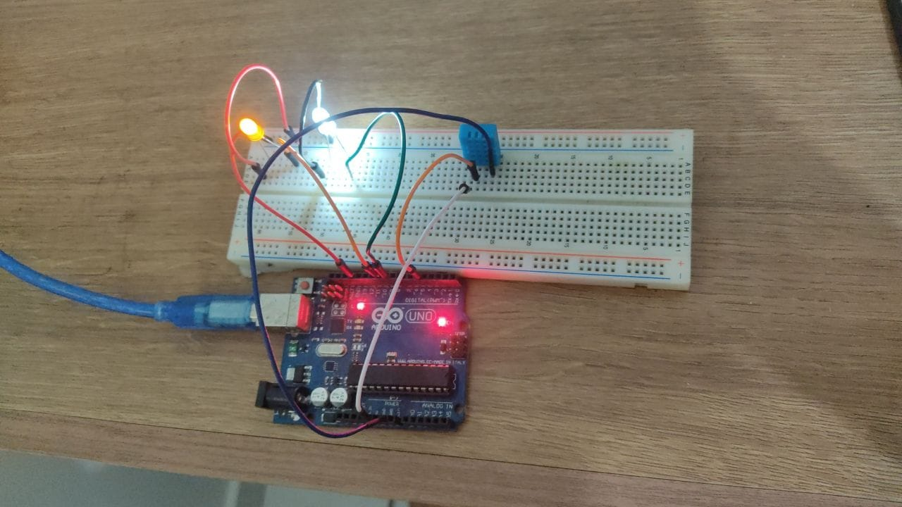
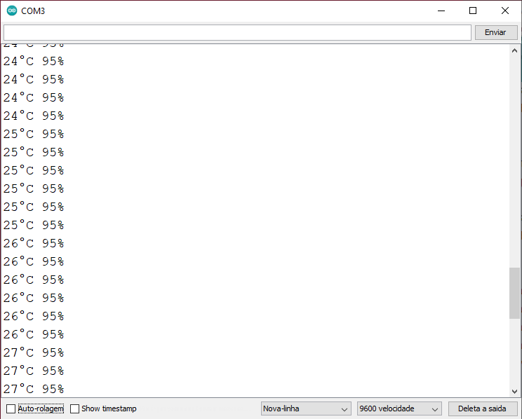

# SSC0180 - Eletrônica para Computação
### Projeto 2 - Arduino
> Projeto com Arduino utilizando o módulo detector de temperatura e umidade
---

### Sumário

- [Componentes](#componentes)
- [Como usar](#como-usar)
- [Imagens de funcionamento, circuito e montado](#Imagens-funcionamento-circuito-montado)
- [Referencias](#referências)
- [Autores](#autores)

---

## Componentes

#### Peças
- Arduino UNO
- 1 LED Branco
- 1 LED Amarelo
- 1 Sensor de temperatura/umidade DHT11
- Jumpers

#### Tecnologias

- Arduino IDE: Ambiente de desenvolvimento usado para programar o Arduino
- TinkerCAD: Ferramenta para criar o design do circuito utilizado no Arduino

---

## Como usar

### Instalação
- Passo 1: Faça o download da IDE de acordo com seu sistema operacional no site https://www.arduino.cc/en/software

- Passo 2: Siga as instruções dadas.

- Passo 3: Clone este repositório utilizando "git clone https://github.com/hitomi1/SSC0180-ProjetoArduino.git"

- Passo 4: Abra o arquivo Projeto.ino

- Passo 5: Clique em "Verificar" no menu superior
- Passo 6: Com o Arduino conectado ao computador clique em "Carregar" no menu superior

#### Código Arduino

```c++
// ===============================================================================
// --- Biblioteca Auxiliar ---
#include  <dht.h>   //biblioteca do sensor de umidade e temperatura
// ===============================================================================
// --- Mapeamento de Hardware ---
#define   dht_pin    5   //pino de sinal do dht11 ligado no digital 5
// ===============================================================================
// --- Declaração de Objetos ---
dht       my_dht;   //objeto para o sensor
// ===============================================================================
// --- Variáveis Globais ---
int     temperatura = 0x00,   //armazena a temperatura em inteiro
        umidade     = 0x00;   //armazena a umidade em inteiro
#define ledBranco   9
#define ledAmarelo  10
// ===============================================================================
// --- Configurações Iniciais ---
void setup()
{
  pinMode(ledBranco, OUTPUT);
  pinMode(ledAmarelo, OUTPUT);
  Serial.begin(9600);   //serial em 9600 baud rate
}
// ===============================================================================
// --- Loop Infinito ---
void loop()
{
  my_dht.read11(dht_pin);

  temperatura = my_dht.temperature;
  umidade     = my_dht.humidity;

  if(temperatura>20){
    digitalWrite(ledBranco,HIGH);
    }
    else{
      digitalWrite(ledBranco,LOW);
    }
  
  if(umidade>75){
    digitalWrite(ledAmarelo,HIGH);
    }
    else{
      digitalWrite(ledAmarelo,LOW);
    }
  
  Serial.print(temperatura);
  Serial.print("°C ");
  Serial.print(umidade);
  Serial.println("% ");
  delay(750);
  
}

```
---

## Imagens





---

## Referências

https://docs.arduino.cc/

https://github.com/simoesusp/Eletronica-para-Computacao

---

## Autores

- Gustavo Hitomi da Silva
- Gustavo Poffo
- Gabriel Faccini
